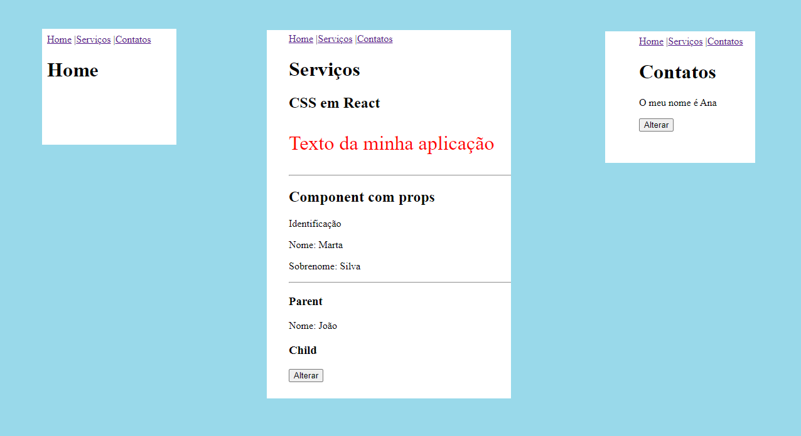

<h1 align="center">
  
</h1>

Esta aplicação está com a versão 5.2.0 do react-router-dom e contém 3 abas de navegação com rotas para a página inicial, de serviços e de contatos.

Além de exemplos sobre:

- Uso de rotas com o react-router-dom
- Propriedades passadas do componente pai para o filho
- A chamada de uma função do componente filho para o pai
- Como estilizar usando CSS em react
- O uso de arrow function component
- O uso de class component
